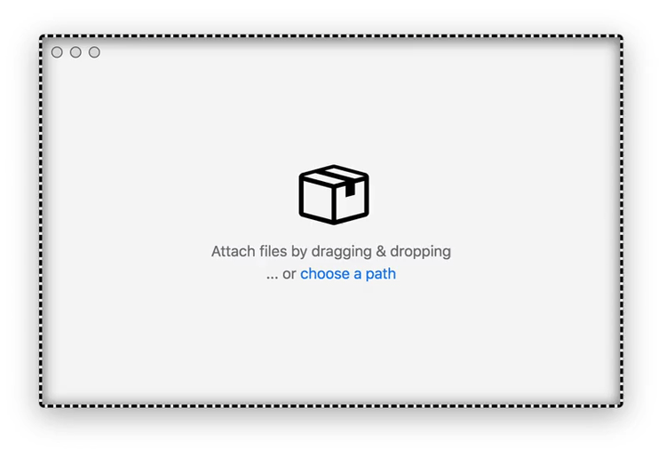

<div align="center">
	
	<h1>airtrash</h1>
	<p>
		<b>Clone of Apple's AirDrop - easy P2P file transfer powered by stupidity</b>
	</p>
	<br>
	<br>
	<br>
</div>



https://github.com/sindresorhus/Gifski
https://github.com/cowbell/sharedrop
https://github.com/seemoo-lab/opendrop
https://github.com/donkeysharp/gocho
https://nitroshare.net/
https://github.com/Jery-Mong/flyfile

```
https://nodejs.org/api/addons.html
https://blog.logrocket.com/node-js-multithreading-what-are-worker-threads-and-why-do-they-matter-48ab102f8b10/
```

# airtrash

## To Use

To clone and run this repository you'll need [Git](https://git-scm.com) and [Node.js](https://nodejs.org/en/download/) (which comes with [npm](http://npmjs.com)) installed on your computer. From your command line:

```bash
# clone this repository
git clone https://github.com/maciejczyzewski/airtrash
# go into the repository
cd airtrash
# install dependencies
yarn
# run the app
yarn start
```

Note: If you're using Linux Bash for Windows, [see this guide](https://www.howtogeek.com/261575/how-to-run-graphical-linux-desktop-applications-from-windows-10s-bash-shell/) or use `node` from the command prompt.

## License

[MIT](LICENSE.md)
